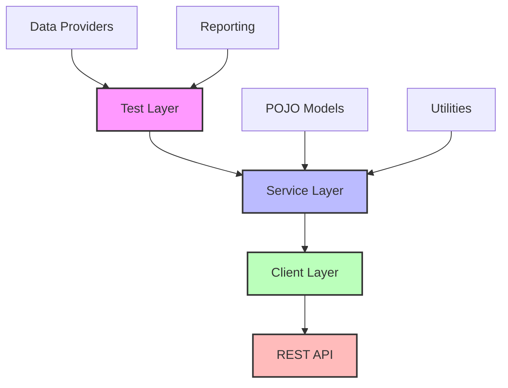
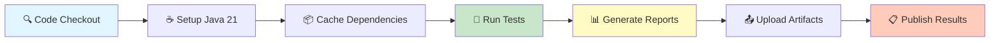

# 🚀 BOOKSTORE API Automation Framework

<div align="center">


[](https://openjdk.java.net/)
[](https://maven.apache.org/)
[](https://rest-assured.io/)
[](https://testng.org/)
[](https://www.extentreports.com/)
[](#)
[](LICENSE)

**A comprehensive, enterprise-grade REST API testing framework built with industry best practices**

[Features](#-key-features) • [Quick Start](#-quick-start) • [Documentation](#-documentation) • [Contributing](#-contributing)

</div>

---

## 📋 Table of Contents

- [🎯 Overview](#-overview)
- [🏗️ Framework Architecture](#️-framework-architecture)
- [✨ Key Features](#-key-features)
- [🚀 Quick Start](#-quick-start)
- [📦 Installation](#-installation)
- [⚙️ Configuration](#️-configuration)
- [🧪 Test Execution](#-test-execution)
- [📊 Test Coverage](#-test-coverage)
- [📈 Reporting](#-reporting)
- [🔄 CI/CD Integration](#-cicd-integration)
- [📝 API Documentation](#-api-documentation)
- [🗂️ Project Structure](#️-project-structure)
- [🎨 Design Patterns](#-design-patterns)
- [🔧 Advanced Features](#-advanced-features)
- [🚦 Best Practices](#-best-practices)
- [🤝 Contributing](#-contributing)
- [📄 License](#-license)
- [🙏 Acknowledgments](#-acknowledgments)

---

## 🎯 Overview

The **BOOKSTORE API Automation Framework** is a production-ready testing solution designed for comprehensive REST API validation. Built with modern Java technologies and following enterprise design patterns, this framework provides robust, scalable, and maintainable API test automation.

### 🎭 Use Cases

- ✅ **Continuous Integration Testing** - Automated regression testing in CI/CD pipelines
- ✅ **API Contract Testing** - Validate API contracts and schemas
- ✅ **Performance Validation** - Response time and throughput testing
- ✅ **Security Testing** - Authentication and authorization validation
- ✅ **Data-Driven Testing** - Comprehensive test coverage with multiple datasets

---

## 🏗️ Framework Architecture

### 🎨 Design Principles

<table>
<tr>
<td width="50%">

#### SOLID Principles
- **S**ingle Responsibility
- **O**pen/Closed
- **L**iskov Substitution
- **I**nterface Segregation
- **D**ependency Inversion

</td>
<td width="50%">

#### Design Patterns
- 🏭 **Factory Pattern** - Object creation
- 👤 **Singleton Pattern** - Configuration management
- 🏗️ **Builder Pattern** - Request/Response specs
- 📋 **Template Method** - Test execution flow

</td>
</tr>
</table>

### 📊 Architecture Diagram



---

## ✨ Key Features

### 🎯 Core Capabilities

| Feature | Description | Technology |
|---------|-------------|------------|
| 🌐 **REST API Testing** | Comprehensive HTTP method support | REST Assured 5.5.6 |
| 🧪 **Test Orchestration** | Advanced test execution with parallel support | TestNG 7.11.0 |
| 📊 **Rich Reporting** | Interactive HTML reports with charts | ExtentReports 5.1.2 |
| 🔧 **Build Automation** | Dependency management and build orchestration | Maven 3.6+ |
| 🚀 **CI/CD Integration** | Automated pipeline execution | GitHub Actions |
| 🔐 **Authentication** | Bearer token & OAuth2 support | Custom implementation |
| 📈 **Performance Testing** | Response time validation | Custom validators |
| 🎲 **Test Data Generation** | Dynamic test data creation | DataFaker 2.4.4 |

### 🌟 Advanced Features

- **🔄 Thread-Safe Execution** - Parallel test execution with ThreadLocal management
- **📝 Custom Annotations** - `@Bookstore` annotation for metadata
- **🎯 Request/Response Specs** - Reusable REST Assured specifications
- **📊 Data-Driven Testing** - TestNG DataProviders with external data sources
- **🔍 Comprehensive Validation** - Custom assertion utilities
- **📋 Configuration Management** - Environment-specific configurations
- **🎨 Fluent API Design** - Builder pattern implementation
- **🚦 Test Categorization** - Smoke, Regression, Performance groups

---

## 🚀 Quick Start

### Prerequisites Check

```bash
# Check Java version (requires Java 21+)
java -version

# Check Maven version (requires 3.6+)
mvn -version

# Check Git installation
git --version
```

### One-Line Setup

```bash
git clone <repository-url> && cd bookstore-api-framework && mvn clean install && mvn test -Psmoke
```

---

## 📦 Installation

### 1️⃣ Clone the Repository

```bash
git clone https://github.com/yourusername/bookstore-api-framework.git
cd bookstore-api-framework
```

### 2️⃣ Install Dependencies

```bash
# Install all dependencies
mvn clean install

# Skip tests during installation
mvn clean install -DskipTests

# Update dependencies to latest versions
mvn versions:use-latest-versions
```

### 3️⃣ Verify Installation

```bash
# Run a single smoke test to verify setup
mvn test -Dtest=HealthTests#testHealthEndpoint_Positive
```

---

## ⚙️ Configuration

### 📄 Configuration Files

#### `src/test/resources/configs/application.properties`

```properties
# 🌍 Environment Configuration
environment=qa

# 🌐 API Configuration
base.url=http://127.0.0.1:8000
request.timeout=5000

# 🔗 API Endpoints
endpoint.health=/health
endpoint.signup=/signup
endpoint.login=/login
endpoint.books=/books/
endpoint.books.id=/books/{id}

# 👤 Test Credentials
test.username=umaji.bagal@bookstore.com
test.password=Bookstore#123

# 🔑 Security
invalid.token=invalid_token_for_testing

# 📊 Test Data
nonExistentId=999999
path.book.id=1
```

### 🌍 Environment-Specific Configuration

```bash
# Run with different environments
mvn test -Denvironment=dev -Dbase.url=https://dev-api.bookstore.com
mvn test -Denvironment=staging -Dbase.url=https://staging-api.bookstore.com
mvn test -Denvironment=prod -Dbase.url=https://api.bookstore.com
```

---

## 🧪 Test Execution

### 📋 Test Execution Commands

```bash
# 🏃 Run all tests
mvn clean test

# 🚀 Run smoke tests only
mvn test -Dgroups=smoke

# 🔄 Run regression tests
mvn test -Dgroups=regression

# 📚 Run specific test categories
mvn test -Dgroups=books
mvn test -Dgroups=auth
mvn test -Dgroups=health

# 🎯 Run specific test class
mvn test -Dtest=BookTests

# 🔍 Run specific test method
mvn test -Dtest=BookTests#verifyCreateBookValidDataTest

# ⚡ Parallel execution
mvn test -DthreadCount=5 -DdataProviderThreadCount=3

# 📊 Run with custom test suite
mvn test -DsuiteXmlFile=src/test/resources/testng-regression.xml
```

### 🏃‍♂️ Test Execution Profiles

| Profile | Command | Description |
|---------|---------|-------------|
| 🚀 **Smoke** | `mvn test -Psmoke` | Critical path tests (8 tests) |
| 🔄 **Regression** | `mvn test -Pregression` | Comprehensive tests (15 tests) |
| 📊 **Full Suite** | `mvn test` | All tests (33 tests) |
| ⚡ **Performance** | `mvn test -Pperformance` | Performance tests (3 tests) |
| 🔐 **Security** | `mvn test -Psecurity` | Security tests (7 tests) |

---

## 📊 Test Coverage

### 📈 Current Test Statistics

<table>
<tr>
<td>

#### Test Distribution
- **Total Tests**: 33
- **Smoke Tests**: 8
- **Regression Tests**: 15
- **Performance Tests**: 3
- **Data-Driven Tests**: 7

</td>
<td>

#### API Coverage
- **Health Endpoint**: 100%
- **Authentication**: 100%
- **CRUD Operations**: 100%
- **Error Scenarios**: 95%
- **Edge Cases**: 90%

</td>
</tr>
</table>

### 🎯 Test Scenarios Matrix

| Module | Positive | Negative | Edge Cases | Performance | Total |
|--------|----------|----------|------------|-------------|-------|
| Health | 2 | 0 | 1 | 1 | **3** |
| Auth | 3 | 3 | 1 | 1 | **7** |
| Books | 10 | 5 | 2 | 1 | **18** |
| Signup | 2 | 0 | 0 | 0 | **2** |
| **Total** | **17** | **8** | **4** | **3** | **33** |

---

## 📈 Reporting

### 📊 ExtentReports Dashboard

The framework generates comprehensive HTML reports with:

- 📈 **Test Execution Timeline** - Visual representation of test execution
- 📊 **Pass/Fail Charts** - Statistical analysis with pie charts
- 🔍 **Detailed Logs** - Step-by-step execution logs
- 📷 **Screenshots** - Failure screenshots (when applicable)
- 🏷️ **Test Categories** - Organized by test groups
- 👤 **Author Attribution** - Test ownership tracking
- 💻 **System Information** - Environment and configuration details

### 📍 Report Locations

```bash
# ExtentReports HTML Report
target/extent-reports/index.html

# TestNG Reports
target/surefire-reports/index.html
target/surefire-reports/testng-results.xml

# Logs
target/logs/api-test.log
```

### 📊 Sample Report Preview

```
┌─────────────────────────────────────┐
│     BOOKSTORE API Test Report      │
├─────────────────────────────────────┤
│ Total Tests:        33              │
│ Passed:            30 (90.9%)       │
│ Failed:             2 (6.1%)        │
│ Skipped:            1 (3.0%)        │
│ Duration:          45.3s            │
│ Environment:       QA               │
└─────────────────────────────────────┘
```

---

## 🔄 CI/CD Integration

### 🏗️ GitHub Actions Workflow

```yaml
name: API Test Automation

on:
  push:
    branches: [main, develop]
  pull_request:
    branches: [main]
  schedule:
    - cron: '0 2 * * *'  # Daily at 2 AM UTC

jobs:
  test-execution:
    runs-on: ubuntu-latest
    strategy:
      matrix:
        test-suite: [smoke, regression, full]
```

### 📊 Pipeline Stages



### 🚀 Jenkins Integration

```groovy
pipeline {
    agent any
    stages {
        stage('Checkout') {
            steps {
                git 'https://github.com/yourusername/bookstore-api-framework.git'
            }
        }
        stage('Test') {
            steps {
                sh 'mvn clean test'
            }
        }
        stage('Report') {
            steps {
                publishHTML([
                    reportDir: 'target/extent-reports',
                    reportFiles: 'index.html',
                    reportName: 'API Test Report'
                ])
            }
        }
    }
}
```

---

## 📝 API Documentation

### 🔐 Authentication Endpoints

#### POST `/signup`
```json
{
  "email": "user@bookstore.com",
  "password": "SecurePass123#"
}
```

#### POST `/login`
```json
{
  "email": "user@bookstore.com",
  "password": "SecurePass123#"
}
```

**Response:**
```json
{
  "access_token": "eyJhbGciOiJIUzI1NiIs...",
  "token_type": "bearer"
}
```

### 📚 Book Management Endpoints

#### GET `/books`
Retrieve all books (requires authentication)

#### POST `/books`
```json
{
  "id": 1,
  "name": "The Great Gatsby",
  "author": "F. Scott Fitzgerald",
  "published_year": 1925,
  "book_summary": "A classic American novel"
}
```

#### PUT `/books/{id}`
Update existing book

#### DELETE `/books/{id}`
Delete book by ID

#### GET `/books/{id}`
Get specific book

---

## 🗂️ Project Structure

```
📦 bookstore-api-framework
├── 📄 pom.xml
├── 📋 README.md
├── 📄 LICENSE
├── 🔧 .github/
│   └── workflows/
│       └── github-actions.yml
├── 📁 src/
│   ├── 📁 main/
│   │   └── java/
│   │       └── com/bookstore/
│   │           ├── 🔌 apis/
│   │           │   ├── book/
│   │           │   ├── health/
│   │           │   ├── login/
│   │           │   └── signup/
│   │           ├── 🌐 client/
│   │           │   └── ApiClient.java
│   │           ├── ⚙️ configs/
│   │           │   ├── BookstoreConfig.java
│   │           │   └── BookstoreConfigReader.java
│   │           ├── 📝 constants/
│   │           ├── 📊 dataproviders/
│   │           ├── 🔢 enums/
│   │           ├── 🏭 factory/
│   │           ├── 👂 listeners/
│   │           ├── 🗃️ pojo/
│   │           ├── 📈 reports/
│   │           ├── 📏 specs/
│   │           ├── 🔑 token/
│   │           ├── 👤 user/
│   │           └── 🛠️ utils/
│   └── 📁 test/
│       ├── java/
│       │   └── com/bookstore/tests/
│       │       ├── BookTests.java
│       │       ├── HealthTests.java
│       │       ├── LoginTests.java
│       │       └── SignupTests.java
│       └── resources/
│           ├── configs/
│           │   └── application.properties
│           └── testng.xml
└── 📁 target/
    ├── extent-reports/
    ├── surefire-reports/
    └── logs/
```

---

## 🎨 Design Patterns

### 🏭 Factory Pattern
```java
// BookFactory - Creates test data objects
Book book = BookFactory.createValidBook(
    "Title", "Author", 2024, "Summary"
);
```

### 👤 Singleton Pattern
```java
// Configuration management
BookstoreConfig config = BookstoreConfigReader.config();
String baseUrl = config.baseUri();
```

### 🏗️ Builder Pattern
```java
// Request/Response specification building
ApiRequestResponseSpec spec = ApiRequestResponseSpec.builder()
    .reqSpec(ApiRequestSpecs.getRequestSpec())
    .respSpec(ApiResponseSpecs.getSuccessResponseSpec())
    .build();
```

### 📋 Template Method Pattern
```java
// Base test class with common setup
public abstract class BaseTest {
    @BeforeMethod
    public void setup() {
        // Common setup logic
    }
}
```

---

## 🔧 Advanced Features

### 🔒 Thread-Safe Token Management

```java
public final class TokenManager {
    private static final ThreadLocal<String> ACCESS_TOKEN = new ThreadLocal<>();
    
    public static String getToken() {
        return ACCESS_TOKEN.get();
    }
}
```

### 🎯 Custom Annotations

```java
@Bookstore(author = "Umaji", category = "Books")
@Test(groups = {"smoke", "regression"})
public void testBookCreation() {
    // Test implementation
}
```

### 📊 Data-Driven Testing

```java
@DataProvider(name = "validBooks", parallel = true)
public Object[][] validBooksData() {
    return new Object[][] {
        {createValidBook("Book1", "Author1", 2024, "Summary1")},
        {createValidBook("Book2", "Author2", 2023, "Summary2")}
    };
}
```

### 🎨 Fluent Assertions

```java
ValidationUtility
    .validateStatusCode(response, 200)
    .validateResponseTime(response, 5000)
    .validateContentType(response, "application/json");
```

---

## 🚦 Best Practices

### ✅ Code Quality Standards

- **📝 Clear Naming Conventions** - Self-documenting method and variable names
- **💬 Comprehensive Documentation** - JavaDoc for all public methods
- **🔍 Code Reviews** - Mandatory peer reviews before merging
- **📊 High Test Coverage** - Minimum 80% code coverage
- **🛡️ Error Handling** - Graceful failure with detailed error messages

### 🏗️ Testing Principles

1. **Test Independence** - Each test runs in isolation
2. **Data Isolation** - No shared test data between tests
3. **Deterministic Results** - Consistent test outcomes
4. **Fast Feedback** - Quick test execution
5. **Clear Failure Messages** - Actionable error information

### 🔐 Security Best Practices

- Never hardcode credentials
- Use environment variables for sensitive data
- Implement token rotation
- Validate SSL certificates
- Sanitize test data

---

## 🤝 Contributing

We welcome contributions! Please see our [Contributing Guidelines](CONTRIBUTING.md).

### 🚀 How to Contribute

1. **Fork the repository**
   ```bash
   git fork https://github.com/yourusername/bookstore-api-framework
   ```

2. **Create a feature branch**
   ```bash
   git checkout -b feature/amazing-feature
   ```

3. **Commit your changes**
   ```bash
   git commit -m 'Add amazing feature'
   ```

4. **Push to the branch**
   ```bash
   git push origin feature/amazing-feature
   ```

5. **Open a Pull Request**

### 📋 Contribution Guidelines

- ✅ Write clear, descriptive commit messages
- ✅ Add tests for new features
- ✅ Update documentation
- ✅ Follow existing code style
- ✅ Ensure all tests pass

---

## 📄 License

This project is licensed under the **MIT License** - see the [LICENSE](LICENSE) file for details.

```
MIT License

Copyright (c) 2024 Bookstore API Framework

Permission is hereby granted, free of charge, to any person obtaining a copy
of this software and associated documentation files (the "Software"), to deal
in the Software without restriction...
```

---

## 🙏 Acknowledgments

- **[REST Assured Team](https://rest-assured.io/)** - For the excellent API testing library
- **[TestNG Contributors](https://testng.org/)** - For the robust testing framework
- **[ExtentReports](https://www.extentreports.com/)** - For beautiful reporting capabilities
- **[Maven Community](https://maven.apache.org/)** - For build automation tools
- **Open Source Community** - For continuous inspiration and support

---

## 📞 Contact & Support

<div align="center">

### 👨‍💻 Maintained by Umaji Bagal

[](https://github.com/yourusername)
[](https://linkedin.com/in/yourusername)
[](mailto:umaji.bagal@bookstore.com)

### 🐛 Found a bug? Have a feature request?

[Open an Issue](https://github.com/yourusername/bookstore-api-framework/issues/new/choose)

### 💬 Need help?

[Start a Discussion](https://github.com/yourusername/bookstore-api-framework/discussions)

</div>

---

<div align="center">

### ⭐ Star this repository if you find it helpful!

**Built with ❤️ for the API Testing Community**

*Last Updated: December 2024 | Version: 1.0.0*

</div>